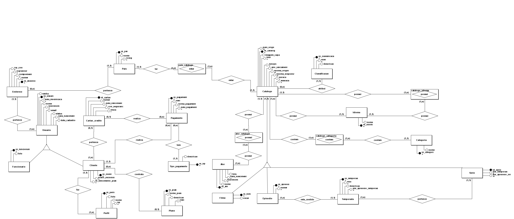
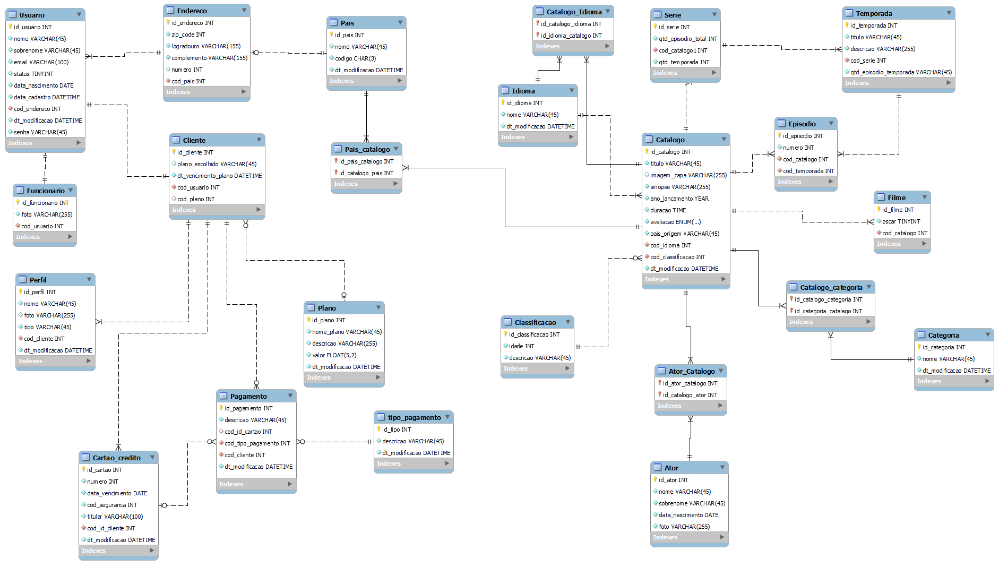

# Projeto Banco de dados Plataforma Streaming

Este projeto tem intuito de demonstrar o conteudo aprendido no curso de **DBA**, para isto foi escolhido como modelo, um banco de dados para plataformas de streaming.
Abaixo estarão os modelos conceitual, lógico e físico.
Observação: podem haver diferenças entre os objetos nos modelos lógico e físico, em função da necessidade de alterar um ou mais para a correção de erros no modelo físico.

## Modelo Conceitual

## Modelo Logico

## Tabelas

- Tabela tb_ator
- Tabela tb_cartao_credito
- Tabela tb_catalogo
- Tabela tb_catalogo_ator
- Tabela tb_catalogo_categoria
- Tabela tb_catalogo_idioma
- Tabela tb_categoria
- Tabela tb_classificação
- Tabela tb_cliente
- Tabela tb_endereco
- Tabela tb_episodio
- Tabela tb_filme 
- Tabela tb_ funcionario
- Tabela tb_idioma
- Tabela tb_pagamento
- Tabela tb_pais
- Tabela tb_pais_catalogo
- Tabela tb_perfil
- Tabela tb_plano
- Tabela tb_serie
- Tabela tb_temporada
- Tabela tb_tipo_pagamento
- Tabela tb_usuario

## Views

- **vw_usuario:** Mostra os usuários e seus atributos.
- **vw_catalogo:** Mostra os dados do catálogo.
- **vw_episodio:** Mostra os dados dos episódios.
- **vw_temporada:** Mostra os dados da temporada.
- **vw_ator:** Mostra os dados dos atores.
- **vw_pagamento:** Mostra os dados do pagamento.
- **vw_perfil:** Mostra os dados dos perfis.

## Funções

- **fn_remover_acento:** Esta função realiza o cadastro de palavras sem acento. 
- **fn_valida_texto:** Esta função realiza a validação do texto, quantidade de caracteres.
- **fn_remover_acento_minusculo:** Esta função faz a remoção de acentos e o cadastro das palavras em minúsculo.

## Procedures

- **sp_insert_classificacao_indicativa:** Esta procedure faz a inserção de dados já com validação.
- **sp_update_classificacao_indicativa:** Esta procedure faz a atualização das classificacões indicativas.
- **sp_delete_classificacao:** Esta procedure realiza o delete de classificações indicativas.
- **sp_insert_categoria:** Esta procedure faz a inserção validada de categorias.
- **sp_update_categoria**:** Esta procedure faz a atualização validada das categorias.
- **sp_delete_categoria:** Esta procedure faz a remoção de categorias.
- **sp_insert_idioma:** Esta procedure faz a inserção validada de idiomas.
- **sp_update_idioma:** Esta procedure faz a atualização validada de idiomas na tabela.
- **sp_delete_idioma:** Esta procedure faz a remoção de idiomas da tabela.
- **sp_insert_tipo_pagamento** Esta procedure faz a inserção validada de formas de pagamento, na tabela.
- **sp_update_tipo_pagamento** Esta procedure faz a atualização validada de formas de pagamento, na tabela.
- **sp_delete_tipo_pagamento** Esta procedure faz a remoção de formas de pagamento, na tabela.
- **sp_insert_pais** Esta procedure faz a inserção validada de novos países na tabela.
- **sp_update_pais** Essa procedure valida e depois atualiza os países no banco.
- **sp_delete_pais** Essa procedure remove países da tabela.
- **sp_insert_plano** Essa procedure faz a inserção de planos no banco.
- **sp_update_plano** Essa procedure valida e depois atualiza os planos.
- **sp_delete_plano** Essa procedure deleta os planos.
- **sp_insert_ator** Essa procedure valida as strings e depois insere atores.
- **sp_update_ator** Essa procedure valida as strings e depois atualiza a tabela atores.
- **sp_delete_ator** Essa procedure deleta atores da tabela.
- **sp_insert_filme** Essa procedure valida as strings e depois faz a inserção de filmes na tabela.
- **sp_update_filme** Essa procedure valida as strings e depois faz atualiza a tabela filmes na tabela.
- **sp_delete_filme** - Essa procedure remove filmes da tabela.
- **sp_insert_catalogo_idioma** Essa procedure realiza inserções na tabela catalogo_idioma.
- **sp_pais_catalogo**  Essa procedure realiza inserções na tabela pais_catalogo.
- **sp_insert_usuario** Essa procedure realiza a validação e inserção de usuarios.
- **sp_insert_funcionario** Essa procedure insere funcionários na tabela, após validação.
- **sp_insert_cliente** Essa procedure insere clientes noatabela, após validação.
- **sp_insert_perfil** Essa procedure insere perfis após validação.
- **sp_insert_cartao_credito** Essa procedure valida e depois insere cartões na tabela.
- **sp_insert_pagamento**  Essa procedure valida e depois insere pagamentos no banco.
- **sp_insert_catalogo_categoria** Essa procedure valida e depois insere dados na tabela.

## Triggers

- **tr_insert_episodio_temporada** Essa trigger atualiza a tabela temporada após um episódio ser adicionado na tabela de episódios.
- **tr_insert_episodio_serie** Essa trigger atualiza a tabela série após a adição de episódios na tabela de episódios.
tr_insert_episodio_serie
- **tr_insert_temporada_serie** Essa trigger atualiza a tabela de séries após ser adicionada uma temporada.

## Scripts

|Scripts    |Clique aqui|
|-----------|-----------|
|DDL        |[Clique aqui](./Scripts/projeto_final_creates-finalizado.sql)|
|Dados      |[Clique aqui](./Scripts\projetofinal_insert-finalizado.sql)|
|Views      |[Clique aqui](./Scripts\viewsprojetofina-finalizado.sql)|
|Funções    |[Clique aqui](./Scripts\functions-projeto-finalizado.sql) 
|Procedures |[Clique aqui](./Scripts\PROCEDURE.sql)
|Triggers |[Clique aqui](./Scripts/TRIGGER.sql)
|Dumps      |[Clique aqui](./Dumps\DumpFullDb_projeto_final21062023.sql)|

